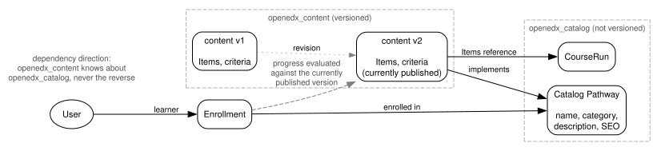

.. _openedx-learning-adr-0004:

4. Pathways: Split Between Catalog and Content
==============================================

Status
------

Draft

Context
-------

Courses in ``openedx-core`` already separate the *catalog* side (``openedx_catalog``: ``CatalogCourse``,
``CourseRun`` - what learners browse and enroll against) from the *content* side (``openedx_content`` - what is
authored, versioned, and published). Pathways have the same two aspects, and the same reasons to keep them apart:

- **Different change rates.** The display name, description shown in the catalog, and SEO metadata are revised
  frequently and casually. The definition of what a learner must do to complete the Pathway changes rarely and
  deliberately.
- **Different people doing the editing.** Catalog data is typically maintained by marketing or communications staff;
  the Pathway definition is maintained by content authors. Both are visible to learners, so the distinction is about
  who edits what, not about who can see it.
- **Different permissions follow from that.** We expect instances to want to let marketing staff update catalog
  copy without granting them the ability to change what learners must complete, and vice versa. Keeping the two
  apart makes that possible without inventing field-level permissions.
- **Auditability.** Progress and credentials must be judged against the definition that was in effect at the time,
  which requires versioning the definition - but versioning catalog copy would be pure overhead.

Decisions
---------

1. A Pathway is split into two parts:

   - **Catalog Pathway** - the learner-browsable, enrollable thing. It includes the display name, the description
     shown in the catalog, SEO metadata, and a **Category**: a student-facing label for the kind of Pathway it is
     (e.g. "Master's Degree", "Annual Training"). If it is specified, learners see the Category instead of the word
     "Pathway". The Catalog Pathway is **not versioned**.

   - **Pathway content** - the definition of the Pathway: its Items and its completion criteria. The content is
     **versioned**, so that we can always tell what the definition was at the moment a learner enrolled or earned a
     credential.

2. In authoring contexts (Studio, Django admin, code, docs), the terminology is always "Pathway", with the Category
   shown explicitly. Relabelling is a learner-facing concern of the catalog side only.

3. Learners enroll against the Catalog Pathway. Progress and credential evaluation run against a version of the
   Pathway content.

Example content of each model:

============================  ==========================
Catalog Pathway               Pathway content
============================  ==========================
Display name                  Pathway Items
Category                      Completion criteria
Description
SEO metadata
Enrollment
============================  ==========================

.. Run `dot -Tsvg images/pathway-catalog-content.dot > images/pathway-catalog-content.svg` to regenerate the diagram
   after making changes to `images/pathway-catalog-content.dot`.

Consequences
------------

- Catalog edits never create new content versions; definition edits (Items, criteria) always do.
- Credential and progress records can reference the exact content version in effect at the time, keeping them
  auditable after the Pathway changes.
- The unversioned Catalog Pathway can be long-lived even if its content definition is changed significantly over time.
