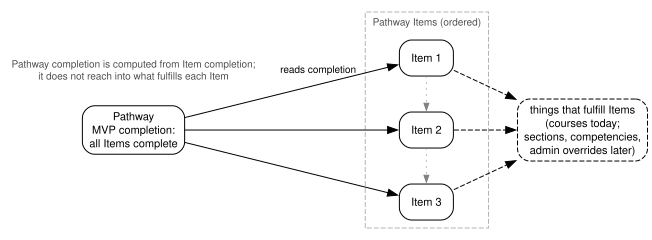

.. _openedx-learning-adr-0005:

5. Pathways: The Boundary Between Pathway and Pathway Item
==========================================================

Status
------

Draft

Context
-------

A Pathway is a set of requirements that a learner works through to earn some larger achievement, such as a
certificate. Each requirement is represented by a **Pathway Item**. We want to draw the boundary between these two
concepts so that the Pathway level stays stable while the Item level - and especially the ways Items get fulfilled -
can evolve.

Decisions
---------

1. A Pathway holds an ordered list of Pathway Items. The order is author-defined and is the order in which Items are
   presented to learners. In the future, we plan to also support enforcing the order of completion.

2. A Pathway Item has its own identity and lifecycle. An Item may be fulfilled by one thing today (e.g. passing a
   course) and by something else tomorrow (e.g. a competency attainment, or an admin override) without changing its
   identity - and therefore without changing the Pathway that contains it. How fulfillment is modeled is a separate
   decision (:ref:`openedx-learning-adr-0006`).

3. Pathway to Item relationships do not break new ground structurally. We already have precedent for modeling
   parent-child relations in ``openedx_content`` containers; Pathway/PathwayItem will not use Container directly,
   as they don't need Container's full complexity.

4. **Item completion and Pathway completion are separate concerns.** An Item is complete or not, determined by its own
   fulfillment rules; the Pathway's completion is computed from Item completion.

5. In the MVP, Pathway completion is not configurable: a Pathway is complete when *all* of its Items are complete.
   Because every Item is fulfilled by passing a course (:ref:`openedx-learning-adr-0006`), this means the learner has
   passed every course in the Pathway, with grade and passed/failed state read directly from each course. Configurable
   criteria (e.g. "complete 4 of these 5 Items") are expected in later iterations, and the intent is for them to be
   expressed in terms of Item completion rather than the Pathway-specific definition of what fulfills each Item.

6. The Item completion contract is deliberately minimal for now - complete or not. It can be extended later to carry
   grades or other metadata, if more complex Pathway-level criteria or learner-facing displays need it.

.. Run `dot -Tsvg images/pathway-and-items.dot > images/pathway-and-items.svg` to regenerate the diagram after making
   changes to `images/pathway-and-items.dot`.

Consequences
------------

- New ways of fulfilling Items can be introduced without restructuring Pathways or rewriting how Pathway completion
  is computed.
- Learner-facing progress ("3 of 6 Items complete") is computed from Item completion, so it also remains stable
  across such changes.
- Interventions like admin overrides act on Item completion and are automatically respected by Pathway completion.
- Extending the Item completion contract beyond a yes/no is an additive change, so nothing here has to be revisited
  to do it.
