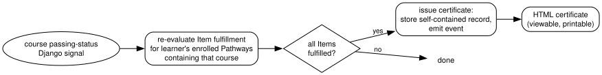

.. _openedx-learning-adr-0007:

7. Pathway Credentials
======================

Status
------

Draft

Context
-------

Learners who complete a Pathway should receive a certificate, in the same way as the built-in Open edX course
certificates. Individual courses inside a Pathway keep their existing course certificates unchanged; this decision is
only about the Pathway-level credential.

Decisions
---------

1. **Earning rule.** A learner earns the Pathway certificate by fulfilling all Items in the Pathway. In the MVP that
   means passing every course in the Pathway, where "passing" is dictated by each course's own grading policy. There
   are no Pathway-level grades, thresholds, or enrollment modes.

2. **Automatic issuance via signals.** The Pathways app listens for the Django signals the platform already emits when
   a learner's course passing status changes. On each relevant signal, it re-evaluates the learner's Item fulfillment
   for any enrolled Pathways containing that course, and issues the certificate as soon as all Items are fulfilled.
   No manual issuing step is required.

3. **Configuration in Django admin.** Pathway certificates are configured in the Django admin, not in Studio. A
   certificate configuration can be created, previewed, edited, and deleted while inactive; it must be activated
   before certificates are issued. Configuration includes the issuing organization and 1–4 signatories (name, title,
   organization, signature image).

4. **Rendering.** An issued certificate is rendered as an HTML page (printable by the learner), analogous to course
   certificates. No W3C Verifiable Credentials / Open Badges support in Willow.

5. **What a certificate is a claim about.** A certificate ties a learner to a specific version of the Pathway
   content: the versioned side of the split described in :ref:`openedx-learning-adr-0004`, because a certificate
   asserts that a particular Pathway completion definition was met. The Catalog Pathway is not recorded separately.
   Instead, it follows from the content version.

6. **Issued certificates are records.** Alongside that reference, a certificate stores a snapshot of everything
   needed to display it later: recipient name, Pathway name, issuer, signatories, the criteria met (the list of
   courses passed), and the date earned. The snapshot is for rendering; the version reference is the authoritative
   part. A certificate remains valid and viewable even if the Pathway is later updated or archived.

7. **Events.** Issuing a certificate emits an event, so that instances can report on credentials (e.g. in Aspects).
   It also sends an email to the learner, with a link to view the certificate.

.. Run `dot -Tsvg images/pathway-credentials.dot > images/pathway-credentials.svg` to regenerate the diagram after
   making changes to `images/pathway-credentials.dot`.

Consequences
------------

- Because issuance uses the existing platform signals, no polling or batch jobs are needed for the typical flow.
- Since certificates are self-contained records, later edits to the Pathway or its certificate configuration never
  alter what a learner already earned.
- Interaction-progress-based criteria, per-course credential rules, badges/microcredentials, and verifiable
  credentials are all explicitly out of scope and can be layered on later without changing the basics of this design.
