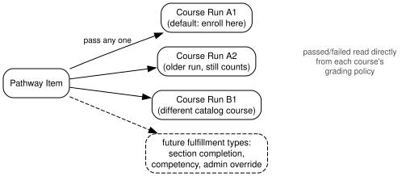
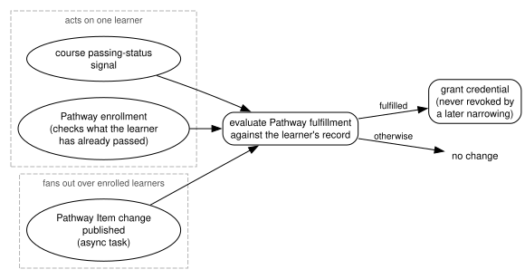

.. _openedx-learning-adr-0007:

6. Pathways: Mapping Pathway Items to the Things That Fulfill Them
==================================================================

Status
------

Draft

Context
-------

:ref:`openedx-learning-adr-0006` establishes that a Pathway Item is a stable requirement whose fulfillment can change
over time. This ADR describes how we intend to map Items to the things that fulfill them, starting with the only
fulfillment type in the first release: passing a course.

The exact data model here will likely need adjustment; we expect to modify it in an actual code PR.
Development does not gate on this ADR - it captures intent and boundaries, not field-level models.

Decisions
---------

1. In the MVP, a Pathway Item is fulfilled by passing a course run:

   - Each Item holds an **author-defined list of course runs** that fulfill it. Passing *any one* of them fulfills
     the Item. The runs may belong to different catalog courses.
   - The list is explicit rather than "any run of this catalog course", because we don't necessarily want every
     possible older version of a course to count.
   - "Passing" is determined by each course's own grading policy. The grade and passed/failed state are read directly
     from the course; Pathways define no grading of their own.
   - Each Item designates a **default course run** - the one a learner is enrolled in when they begin the Item - and,
     if that course uses multiple enrollment tracks, the track to enroll them in. The default can change over time.

2. Fulfillment types attach at this layer only. Potential future types - section completion, competency attainment,
   admin override - plug in as alternative ways to fulfill an Item, without touching Item identity, Pathway structure,
   or Pathway completion criteria.

3. Edge cases are resolved at this layer and never leak upward. For example: multiple passed runs fulfilling the same
   Item (the Item is simply fulfilled), or one passed run fulfilling several Items simultaneously (each Item is
   fulfilled independently).

4. Prior work counts. If a learner passed a course before enrolling in a Pathway that contains it, that pass fulfills
   the corresponding Item - fulfillment is evaluated against the learner's record, not against activity that happened
   "inside" the Pathway.

5. Item fulfillment is evaluated at three moments:

   - **A course passing-status signal.** The learner's fulfillment is re-evaluated for the Items whose run list
     includes that run, in the Pathways they are enrolled in.
   - **Pathway enrollment.** A one-time check goes through everything the learner has already passed, which is what
     makes decision 4 work.
   - **Publishing changes to a Pathway Item.** An async task goes through the learners currently enrolled in
     the Pathway containing that Item and retroactively evaluates the fulfillment.

6. The third trigger exists because the first two do not cover this sequence:

   a. A learner passes Course Run A, which at the time fulfills nothing in the Pathway.
   b. The learner enrolls in the Pathway. The enrollment check finds nothing relevant.
   c. An author edits a Pathway Item so that Course Run A now fulfills it, and publishes the change.

   No passing signal fires at step (c), and the enrollment check has already run, so without the async task the
   Item would never be fulfilled for that learner, even though their record now satisfies it.

7. The task fires on publishing, not on draft edits, so an author can revise an Item repeatedly and only the
   published result reaches learners.

8. Retroactive evaluation only grants credentials. Narrowing an Item, by removing a course run that used to
   fulfill it, does not revoke credential a learner has already been awarded.

.. Run `dot -Tsvg images/pathway-item-fulfillment.dot > images/pathway-item-fulfillment.svg` to regenerate the
   diagram after making changes to `images/pathway-item-fulfillment.dot`.

.. Run `dot -Tsvg images/pathway-item-evaluation.dot > images/pathway-item-evaluation.svg` to regenerate the diagram
   after making changes to `images/pathway-item-evaluation.dot`.

Consequences
------------

- Authors control exactly which runs count, at the cost of manually updating the list when new runs are created.
- Because passing state comes directly from course grading, there is no Pathway-side duplication of grades to keep in
  sync.
- Only the third trigger needs an async task: the first two act on a single learner, while publishing an Item change
  fans out across everyone enrolled in the Pathways that contain it.
- Publishing an Item change on a large Pathway is therefore not instantaneous. Retroactive credentials appear once the
  task completes.
- The fulfillment mapping is the natural extension point for everything post-MVP, and the part of the model we
  expect to iterate on in code.
