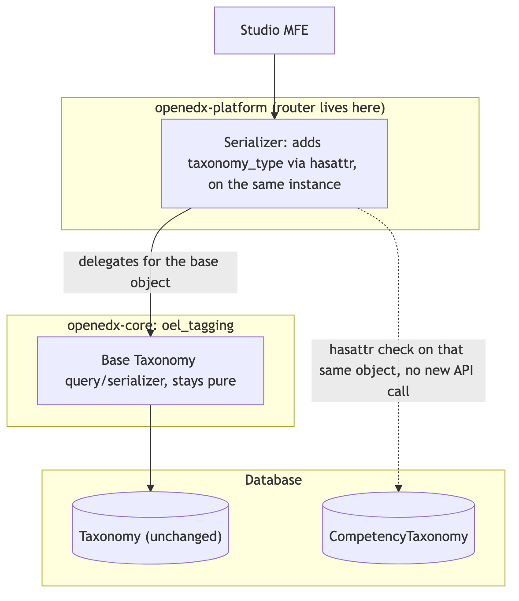

.. _openedx-tagging-adr-0013:

13. Competency taxonomy detection in openedx-platform
=======================================================

Status
------

Accepted

Context
-------

The taxonomy Get endpoints need to report whether a taxonomy is a Competency Taxonomy, so
that Studio can badge Competency Taxonomies and gate access to the Competency Management
page, symmetrically with the Create/Import endpoint's ``taxonomy_type`` field.
``CompetencyTaxonomy`` is a Django multi-table-inheritance subclass of
``Taxonomy``, owned by the CBE applet and defined in
`ADR 0002 <../../openedx_learning/decisions/0002-competency-criteria-model.rst>`_.

``openedx_tagging`` is a generic tagging library with no knowledge of any specific taxonomy
flavor built on top of it, CBE or otherwise, and must not gain any: a specific downstream
applet's model or relation name has no business appearing in this library's source, since
that reverses the intended dependency direction (CBE depends on ``openedx_tagging``, not
the other way around) and would break for any Open edX install running ``openedx_tagging``
without CBE installed.

Decision
--------

Report a taxonomy's type entirely within **openedx-platform**, using the existing relation
between ``Taxonomy`` and ``CompetencyTaxonomy`` established in ADR 0002, without adding any
field, method, or enum value to ``openedx_tagging``:

         base Taxonomy serializer for the Taxonomy row, and separately runs a hasattr check
         against the same already-fetched instance to detect a related CompetencyTaxonomy
         row, with no new API call and no changes to oel_tagging.

- openedx-platform's REST layer adds a read-only ``taxonomy_type`` value to its taxonomy
  serializer, computed by checking whether a related ``CompetencyTaxonomy`` row exists for
  that ``Taxonomy``: ``"competency"`` if so, ``"tags"`` otherwise.
- It performs that check through the CBE app's public API,
  ``openedx_learning.api.is_competency_taxonomy()``, rather than naming the relation itself.
  The relation name is a Django-generated default derived from the model's class name, so
  spelling it in openedx-platform would let a rename upstream break Studio with nothing
  failing in either repository's tests.
- That same layer's queryset fetches the related ``CompetencyTaxonomy`` row alongside the
  ``Taxonomy`` list, using the companion ``select_competency_taxonomies()``, so the check
  costs no extra query per row.
- ``openedx_tagging``'s ``Taxonomy`` model and its base ``TaxonomySerializer`` gain nothing
  for this purpose: no new field, no new enum value, no import. That constraint is on
  ``openedx_tagging`` alone. The CBE app owns this relation, so exposing it through the CBE
  app's own public API is expected rather than avoided.
- No creation-time wiring is needed to keep this accurate: ADR 0002 Decision 1 already
  creates the ``CompetencyTaxonomy`` row in the same transaction as its parent ``Taxonomy``
  row, so the existence check can never drift out of sync the way a separately-stored
  field could.

**Known trade-off.** A future third taxonomy type needs another hardcoded branch in
openedx-platform's shared serializer, the same cost a field-based approach would have
avoided with a one-line enum addition. Accepted because keeping ``openedx_tagging`` free of
any competency-specific reference, even an inert stored value, was judged more valuable
than that extensibility, particularly given the project's move away from system-defined
taxonomies, which makes a third taxonomy flavor unlikely soon.

Rejected Alternatives
----------------------

``taxonomy_type`` enum field on the base ``Taxonomy`` model
~~~~~~~~~~~~~~~~~~~~~~~~~~~~~~~~~~~~~~~~~~~~~~~~~~~~~~~~~~~~

A ``TaxonomyType(models.TextChoices)`` field (``TAGS``/``COMPETENCY``) added directly to
``Taxonomy``, set by whichever code creates a ``CompetencyTaxonomy`` row, in the same
transaction as ADR 0002 Decision 1's existing lifecycle rule. Although this requires no
per-request check and was more extensible for a hypothetical third taxonomy flavor, it
still named a CBE-specific concept, a ``COMPETENCY`` enum value, directly in
``openedx_tagging``'s own schema and public API. Keeping ``openedx_tagging`` fully free of
any competency-specific reference, even an inert one, is worth the lost extensibility.

Check for a related ``CompetencyTaxonomy`` row directly inside ``openedx_tagging``
~~~~~~~~~~~~~~~~~~~~~~~~~~~~~~~~~~~~~~~~~~~~~~~~~~~~~~~~~~~~~~~~~~~~~~~~~~~~~~~~~~~

Using ``hasattr(instance, "competencytaxonomy")`` inside ``openedx_tagging``'s serializer.
Needed no migration and, unlike the field-based approach above, could never drift out of
sync since it read the relation directly instead of a separately-stored value. Rejected
because it hardcodes a specific downstream applet's multi-table-inheritance relation name
into a standalone, generic library, which is exactly the reverse-dependency problem this
decision exists to avoid. It also risks an N+1 query on every taxonomy list request unless
``openedx_tagging``'s own queryset adds a matching ``select_related``, a cost every
consumer of that shared serializer would inherit, not just openedx-platform.

Two-call frontend create flow
~~~~~~~~~~~~~~~~~~~~~~~~~~~~~~

Studio calls the plain create-taxonomy endpoint, then makes a second call to a separate,
CBE-owned endpoint to convert it to a competency taxonomy, with no new REST surface needed.
Rejected because the frontend must orchestrate both calls itself and handle the case where
the first succeeds but the second fails, leaving a plain taxonomy behind with no competency
conversion.

New combined competency REST API
~~~~~~~~~~~~~~~~~~~~~~~~~~~~~~~~~~

A single new CBE-owned endpoint that creates both the ``Taxonomy`` and
``CompetencyTaxonomy`` rows atomically. Rejected because it is a new endpoint to design,
build, and maintain, and the frontend still needs both this call and the plain
create-taxonomy call, choosing between them since nothing upstream tells it in advance
whether a Tags or Competency taxonomy is being created; that branching just relocates the
type-awareness into the frontend rather than removing it.

An overridable ``Taxonomy.get_type()`` method
~~~~~~~~~~~~~~~~~~~~~~~~~~~~~~~~~~~~~~~~~~~~~~~

A base ``Taxonomy.get_type()`` method returning ``"tags"``, overridden by
``CompetencyTaxonomy`` to return ``"competency"``, mirroring the existing
``Taxonomy.system_defined`` / ``SystemDefinedTaxonomy`` base/override shape. Rejected for
two independent reasons:

- That base/override shape is implemented via ``Taxonomy._taxonomy_class`` and
  ``Taxonomy.cast()``/``Taxonomy.copy()``, which are planned to be removed as a pattern.
- Querying taxonomies the normal way (``Taxonomy.objects.all()``) returns plain ``Taxonomy``
  instances, so a subclass method override is never reached without an explicit cast step
  first. The existing ``.cast()``/``.copy()`` implementation would not correctly perform
  that cast for a true multi-table-inheritance subclass in any case: it copies a hardcoded
  list of base ``Taxonomy`` field values in Python and never queries the subclass's own
  table, so it would silently produce a ``CompetencyTaxonomy`` instance with unset or wrong
  subclass-specific fields.
